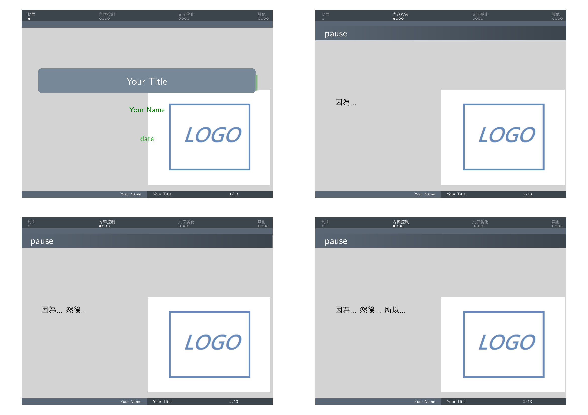

# 進階
### 1.加入Logo
* logo.png
</br></br>  

```Latex
\logo{\includegraphics{logo.png}}
```
* Template:
    </br></br>
### 2.自訂顏色
```Latex
\definecolor{mycolor}{rgb}{0.2, 0.4, 0}
```
### 3.beamercolor
* beamercolor
    * 前景色fg
    * 背景色bg
```Latex
\setbeamercolor{normal text}{fg=Green,bg=LightGray}
```
* Template:
    </br></br>
### 4.以圖片為背景
</br></br> 

```Latex
\usebackgroundtemplate{\includegraphics[width=
\paperwidth]{test_pg.png}}
```
* Template:
    </br></br>
### 5.加入影片[win10有問題]
* multimedia套件
* 重覆播放
```Latex
\usepackage{multimedia}
\movie[width=5cm,height=2.8cm,loop]{}{test.avi}
```