## 印講義 --- [Back](https://github.com/Wilhelmine21/LaTeX-Beamer-PPT#how-to-create-a-ppt-using-latex)
* 不想要有overlay => 每次就一張
### 1.加入handout 參數
```Latex
\documentclass[handout]{beamer}
```
### 2. 1Page A4->印出N張投影片
* pgfpages 套件
```Latex
\usepackage{pgfpages}
%印出2張/1page
\pgfpagesuselayout{2 on 1}[a4paper,border shrink=5mm]
```
* Template:
    </br>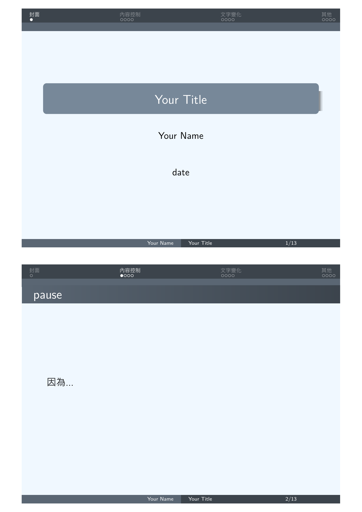
    
    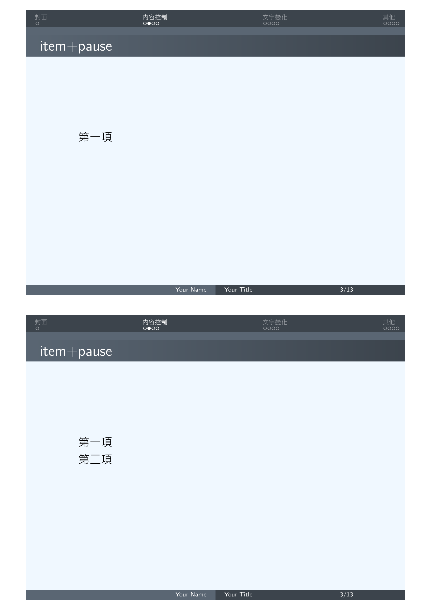
    
    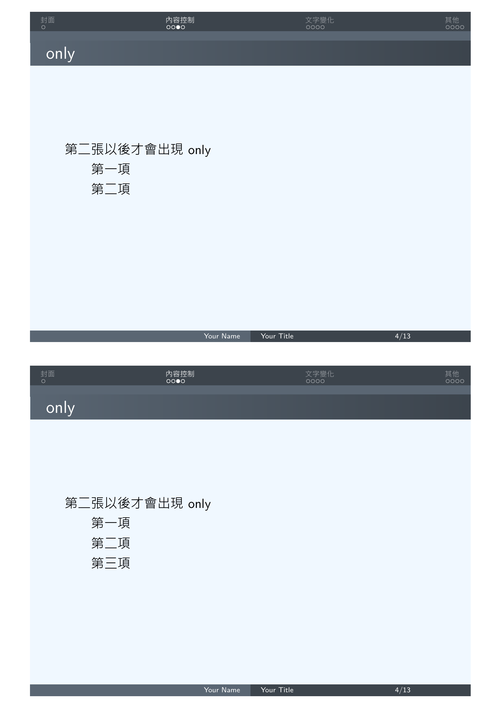
    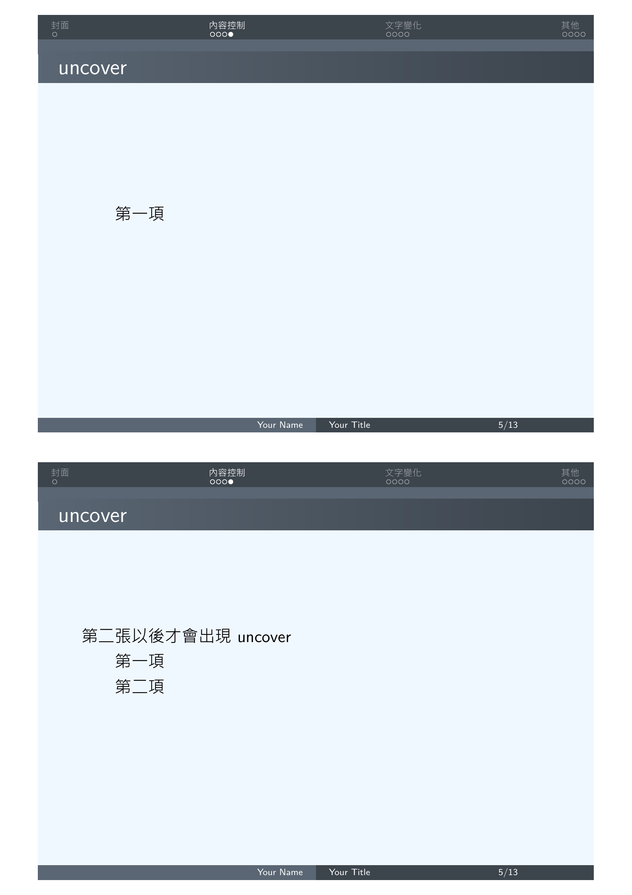
    
    
    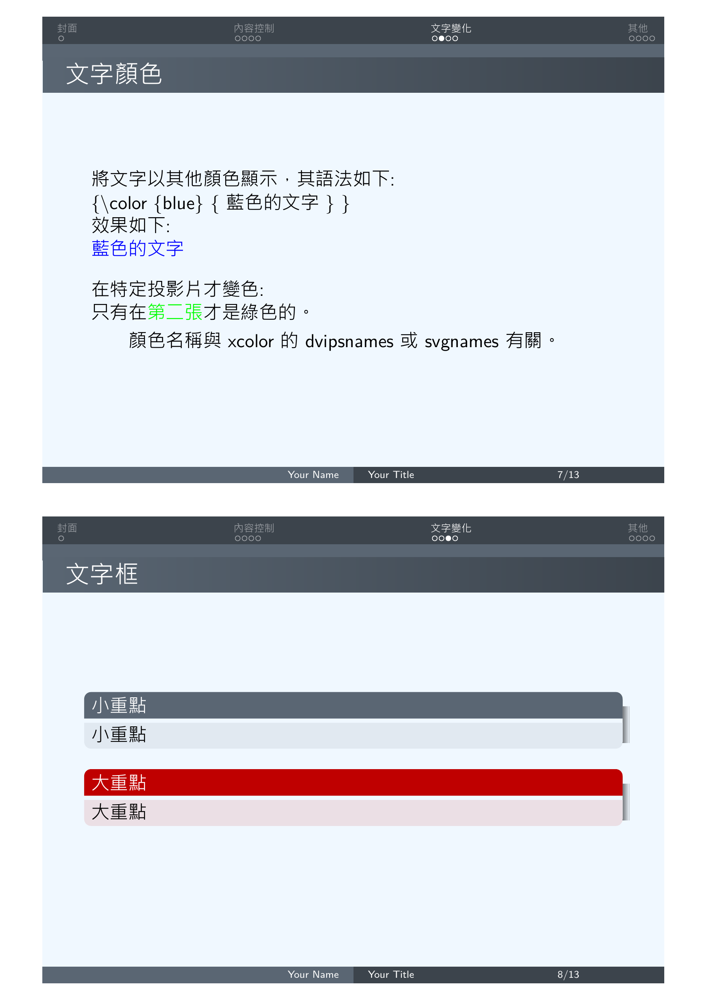
    
    
    </br>

<!-- * pgfpages 套件 + Xelatex
    * 需加入以下指令
    ```Latex
    \renewcommand\pgfsetupphysicalpagesizes{%
    \pdfpagewidth\pgfphysicalwidth\pdfpageheight%
    \pgfphysicalheight}
    ``` -->
### 3.橫向印出
```Latex
\usepackage{pgfpages}
%印出4張/1page, 橫向
\pgfpagesuselayout{4 on 1}[a4paper, border shrink=5mm, landscape]
```
* Template:
    </br>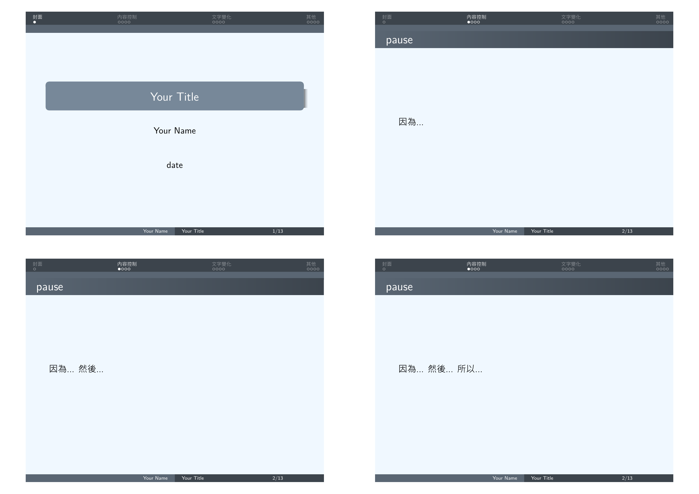
    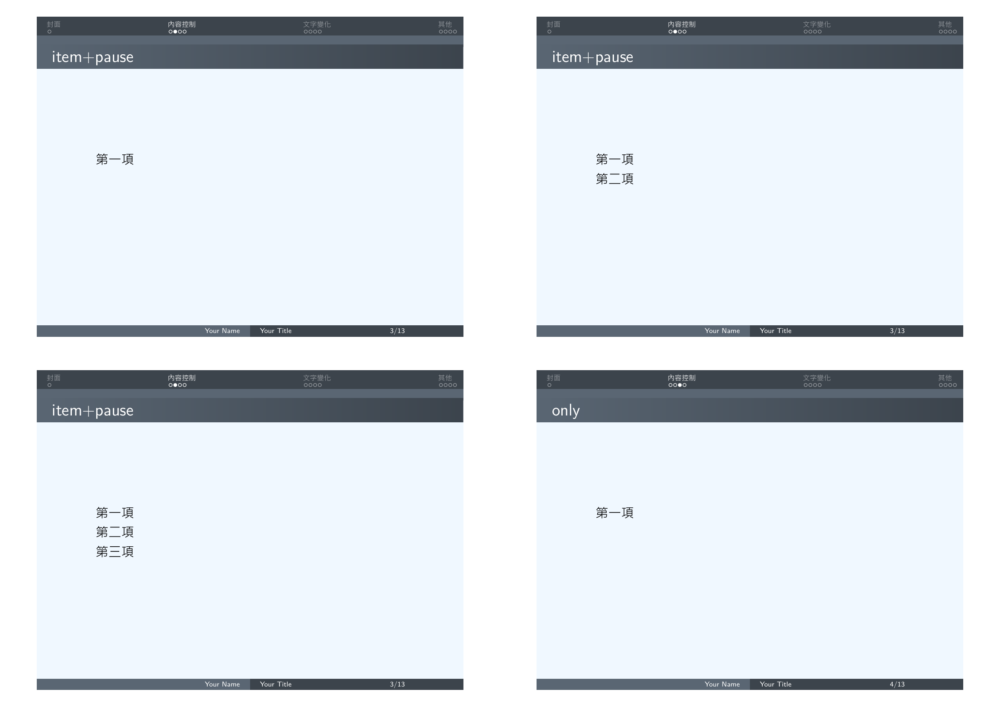
    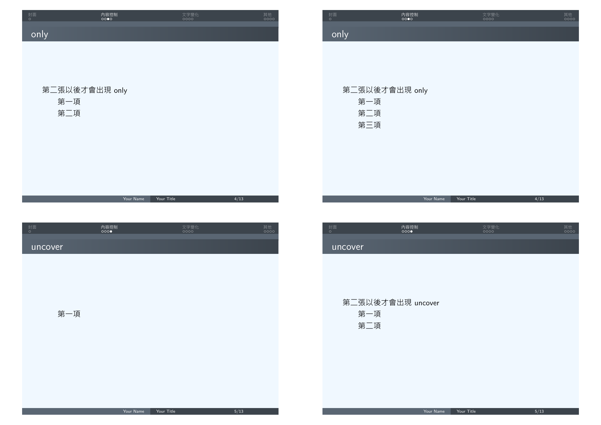
    
    
    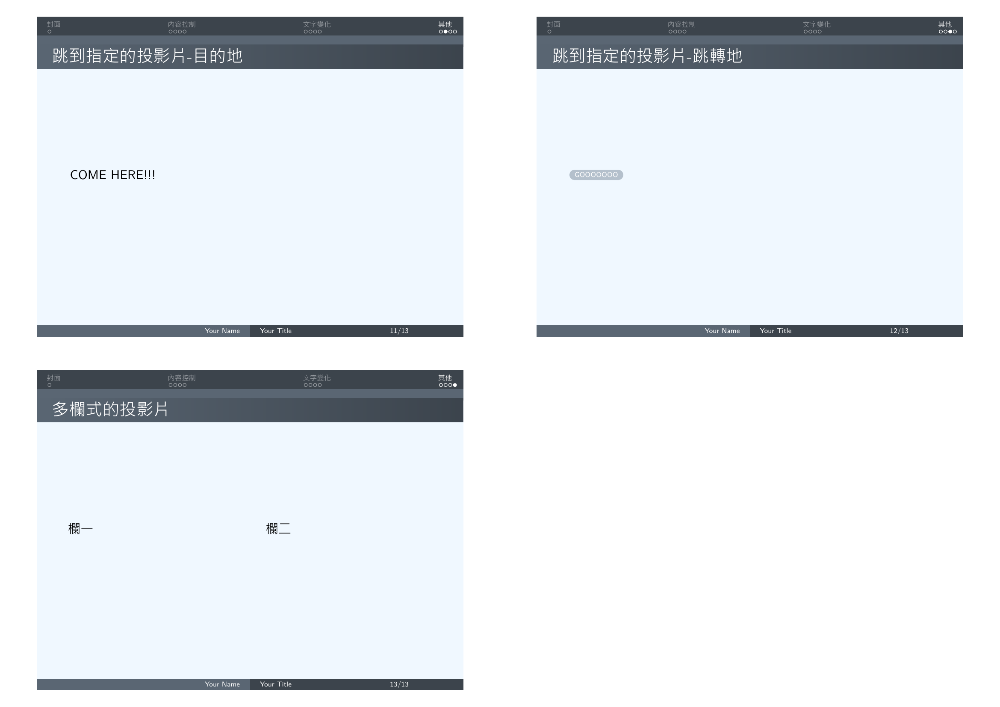</br>

### 4.有筆記空間
* `handoutWithNotes`
1. 引用
```Latex
\usepackage{handoutWithNotes}
```
2. 決定幾張PPT放一起
```Latex
\pgfpagesuselayout{4 on 1 with notes}[a4paper,
border shrink=5mm]
```
* Template:
    * 直向:
        </br>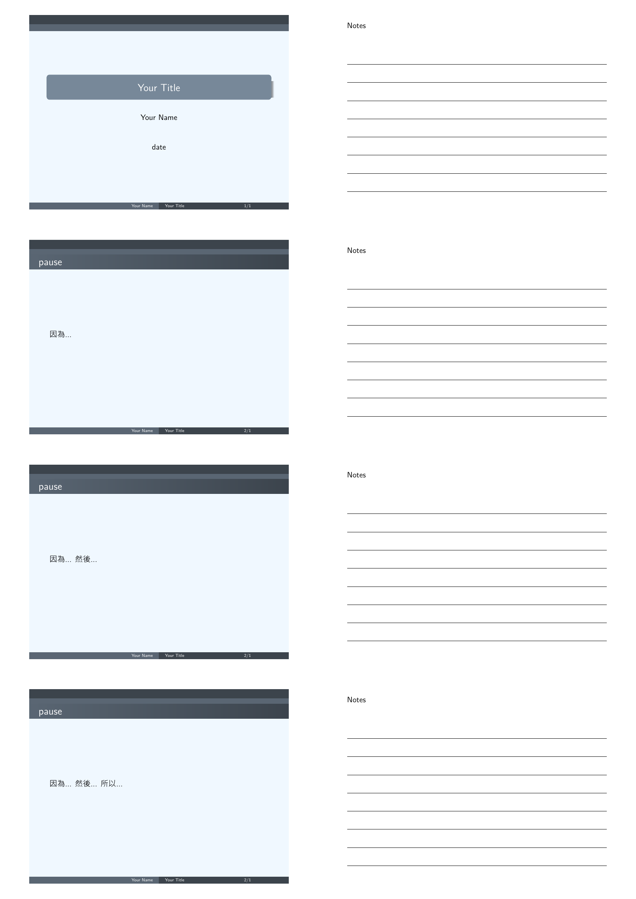</br>
    * 橫向:
        </br>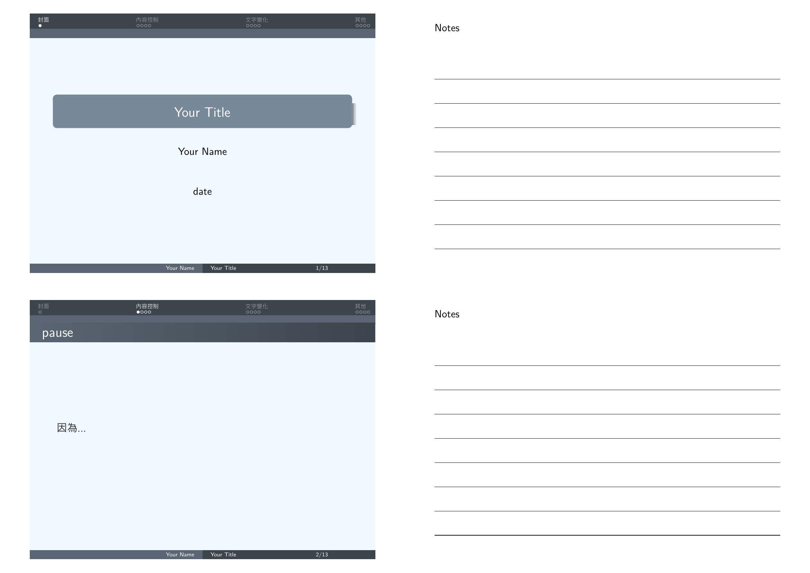</br>