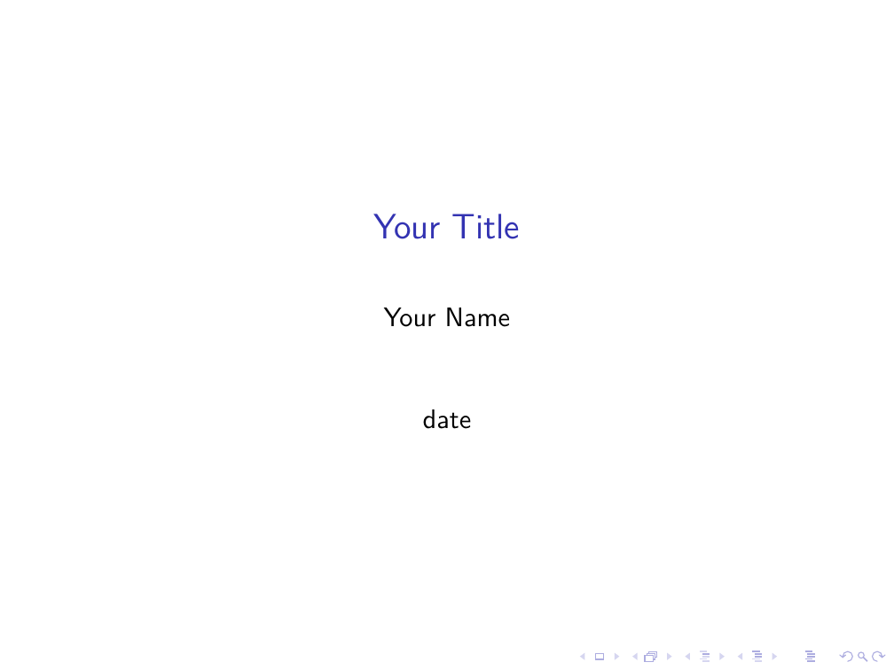
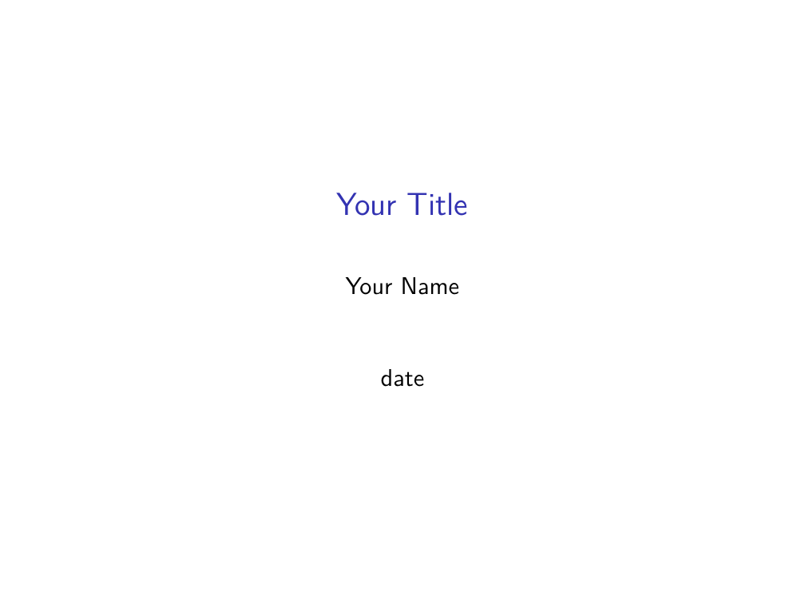
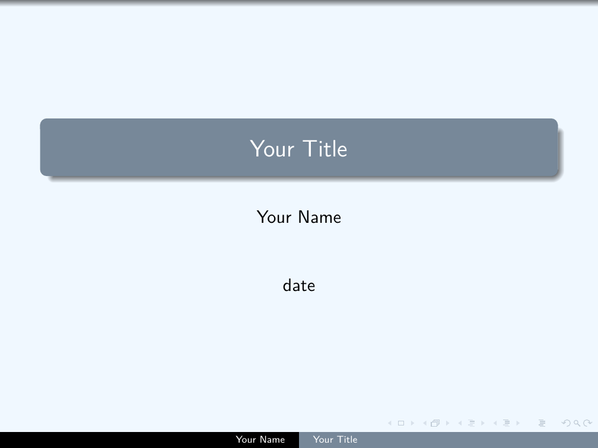
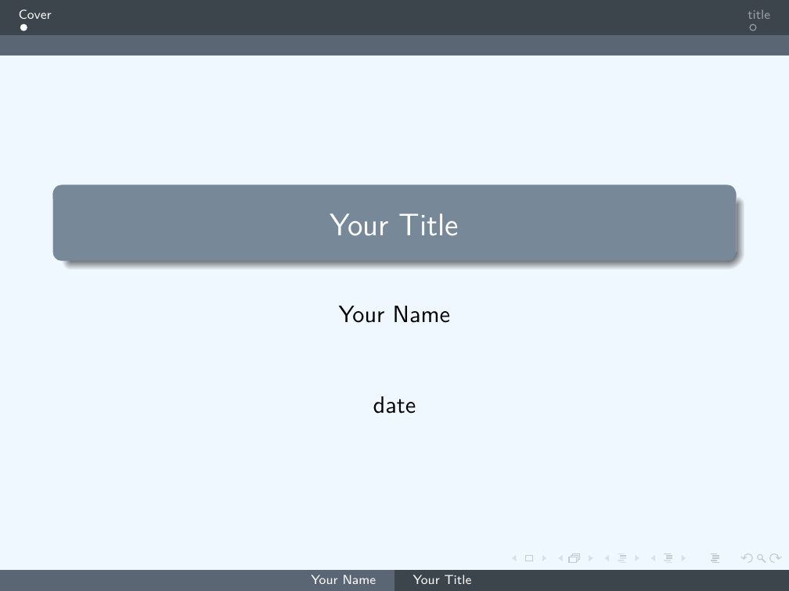
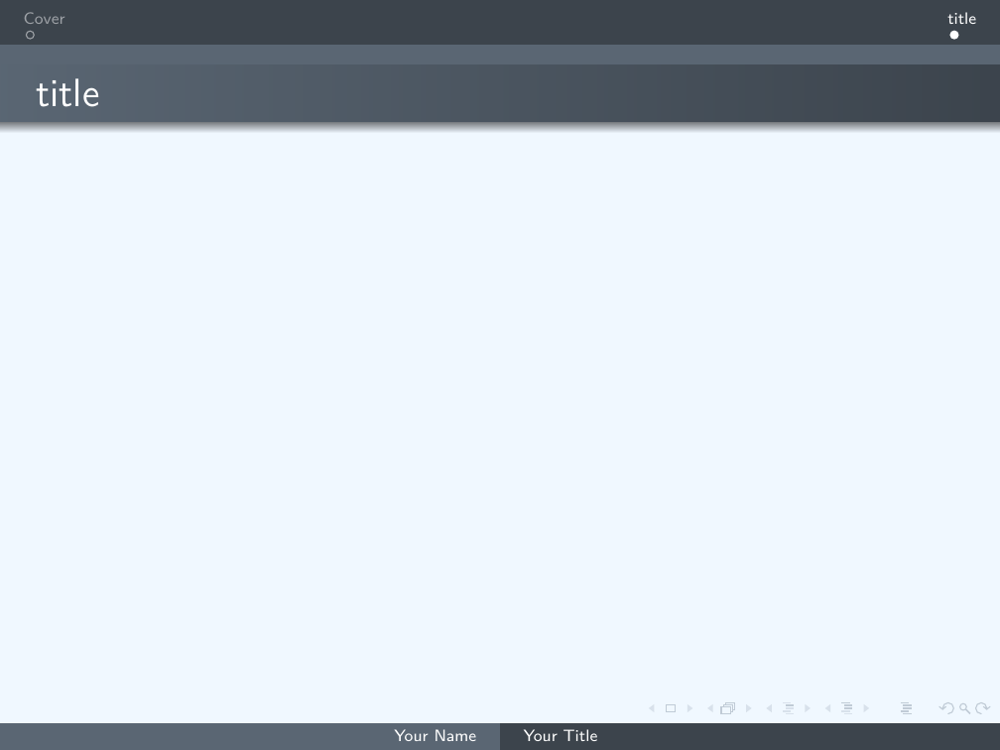

# How to create a ppt using LaTeX
* We can use LaTeX to make a presentation, and it will be a PDF file.
* Beamer
## 基本使用
1. 開頭引用
    ```LaTeX
    \documentclass{beamer}
    \begin{document}
    %%% content %%%
    \end{document}
    ```
2. 中文使用與字體指定
    ```LaTeX
    \usepackage{xeCJK}
    \setCJKmainfont{微軟正黑體}
    ```
3. 投影片首頁資訊
    ```LaTeX
    \title{Your Title} 
    \author{Your Name}
    \date{date}

    \begin{frame}
    \titlepage
    \end{frame}
    ```
    * Template:
    </br></br>

4. 加入投影片與標題
    ```LaTeX
    \begin{frame}
    \frametitle{title} %投影片標題
    %%% content %%%
    \end{frame}
    ```
    * Template:
    </br></br>
5. 不顯示提示欄
    ```LaTeX
    \setbeamertemplate{navigation symbols}{}% 隱藏提示欄
    ```
    * Template:
    </br></br>

## 主題變換
```LaTeX
\usetheme{ThemeName}
```
* 內建主題  
    |AnnArbor|Dresden |Marburg |
    |:-:|:-:|:-:|
    |Antibes |Frankfurt |Montpellier |
    |Bergen |Goettingen |PaloAlto |
    |Berkeley |Hannover |Pittsburgh |
    |Berlin |Ilmenau |Rochester |
    |Boadilla |JuanLesPins |Singapore |
    |CambridgeUS |Luebeck |Szeged |

1. 顏色自定義
    ```LaTeX
    \documentclass[xcolor=svgnames]{beamer}
    \usecolortheme[named=LightSlateGrey]{structure}
    \setbeamercolor{normal text}{fg=black,bg=AliceBlue}
    \usetheme{Warsaw}
    ```
    * 使用xcolor去改變顏色
        * dvipanames
        * svgnames
    * Template:
    </br></br>
2. 樣式修改  
    * 內主題:
        ```LaTeX
        \useinnertheme{circles}
        ```
        * circles, inmargin, rectangles, rounded 
    * 外主題:
        ```LaTeX
        \useoutertheme{miniframes}
        ```    
        *  infolines, miniframes, shadow, sidebar, smoothbars, smoothtree, split, tree 
        * Template:
            * 要加入section才會顯示出名稱
                ```LaTeX
                \section{SectionName}
                ```
        </br>
    * 標記:
        ```LaTeX
        \setbeamertemplate{items}[rectangle]
        ```
        |Name |Description |
        |:-:|:-:|
        |ball |3D 球形|
        |circle |2D 圓形|
        |rectangle |2D 方形|
        |default |2D 三角|
