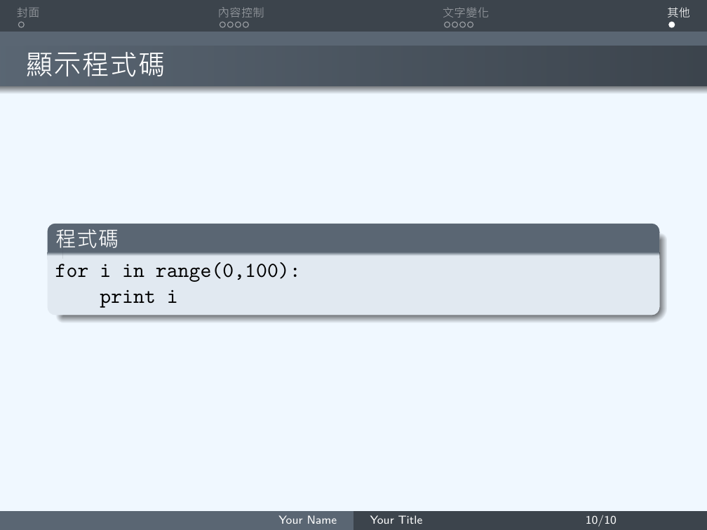
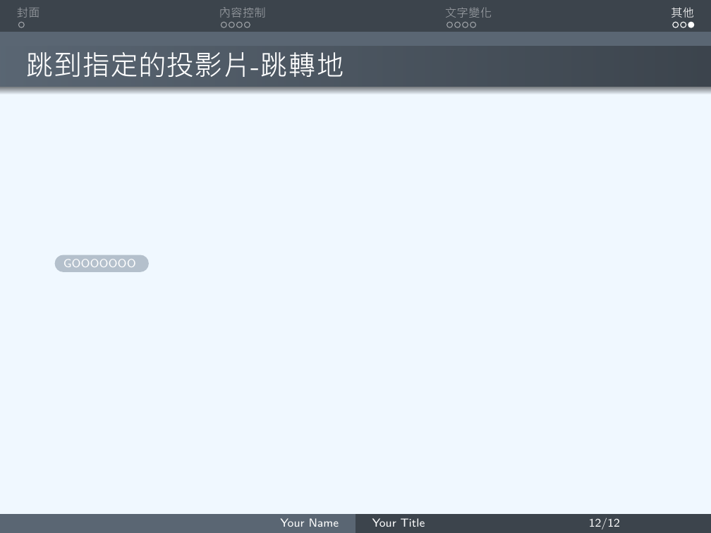
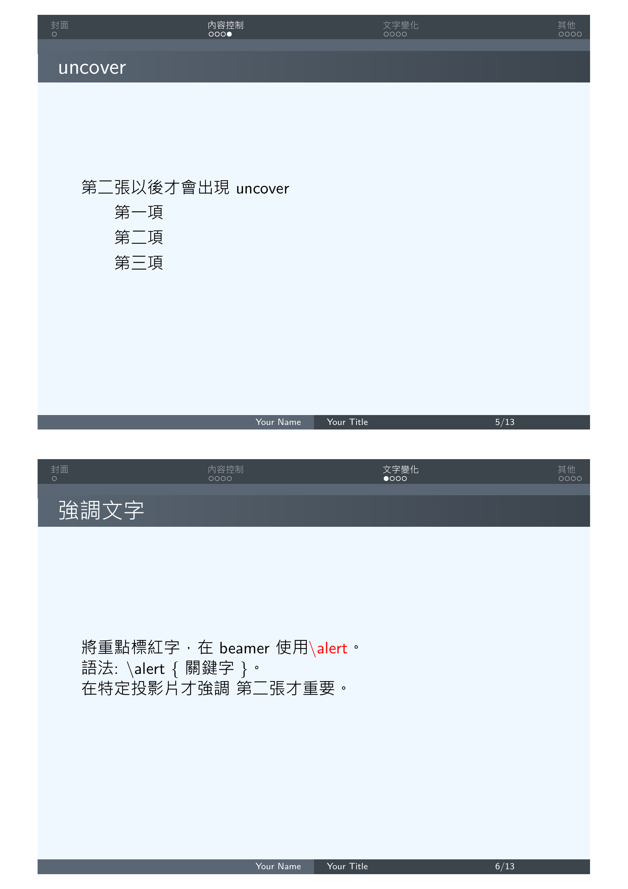
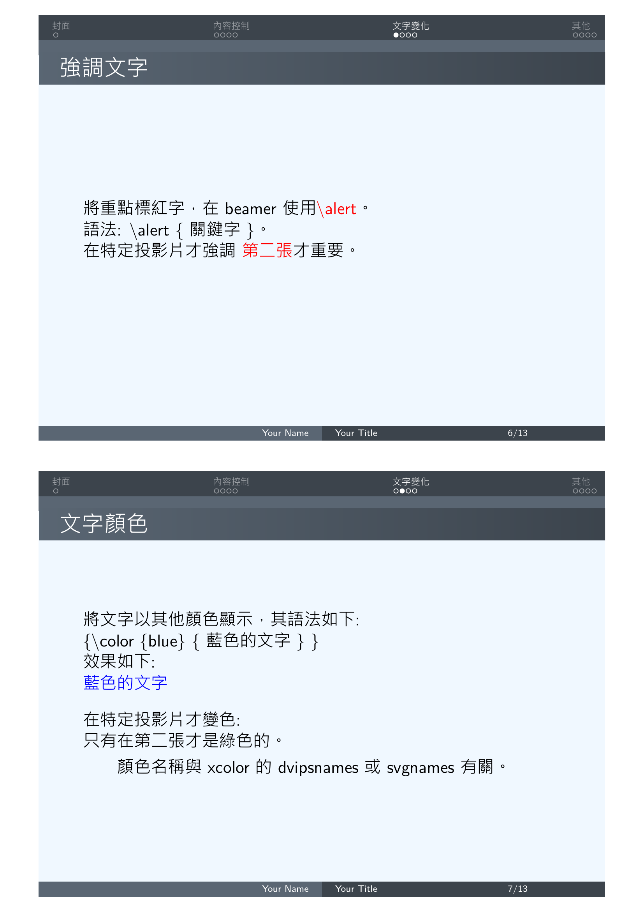
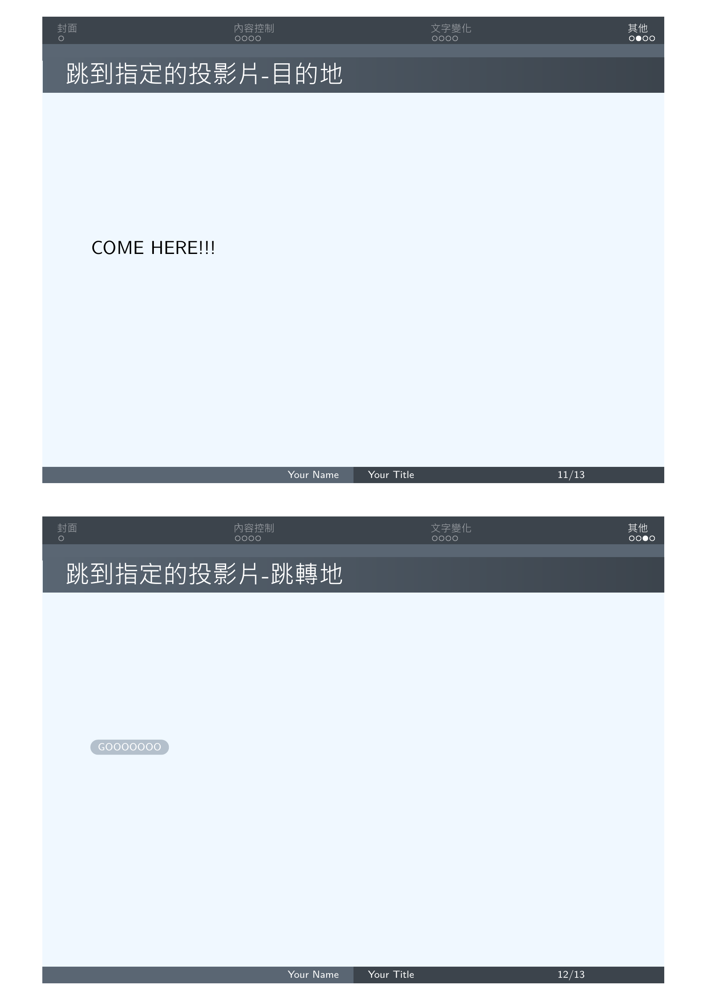
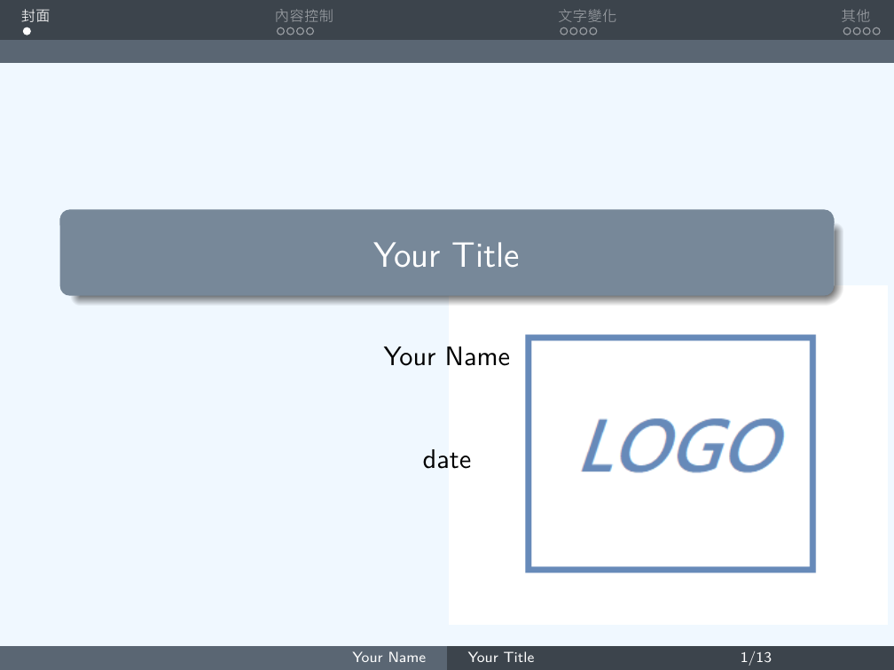

# How to create a ppt using LaTeX
* We can use LaTeX to make a presentation, and it will be a PDF file.
* Beamer
## 目錄
* I. [基本使用](https://github.com/Wilhelmine21/LaTeX-Beamer-PPT#基本使用)  
    * 1. [開頭引用]()
    * 2. [中文使用與字體指定]()
    * 3. [投影片首頁資訊]()
    * 4. [加入投影片與標題]()
    * 5. [不顯示提示欄]()
* II. [主題變換](https://github.com/Wilhelmine21/LaTeX-Beamer-PPT#主題變換)
    * 1. [顏色自定義]()
    * 2. [樣式修改]()
* III. [內容控制](https://github.com/Wilhelmine21/LaTeX-Beamer-PPT#內容控制)
    * 1. [使用\pause來分段]()
    * 2. [條列式也可以用\pause暫停]()
    * 3. [更精確的控制- only vs uncover]()
* IV. [文字變化](https://github.com/Wilhelmine21/LaTeX-Beamer-PPT#文字變化)
    * 1. [標紅重點字]()
    * 2. [文字顏色]()
    * 3. [文字框]()
    * 4. [內建定理]()
* V. [其他](https://github.com/Wilhelmine21/LaTeX-Beamer-PPT#其他)
    * 1. [顯示程式碼]()
    * 2. [文中引用程式碼]()
    * 3. [跳到指定的投影片]()
    * 4. [多欄式的投影片]()
    * 5. [縮小參數&印出頁碼指令]()
* VI. [印講義](https://github.com/Wilhelmine21/LaTeX-Beamer-PPT#印講義)
    * 1. [加入handout 參數]()
    * 2. [1Page A4->印出N張投影片]()
    * 3. [橫向印出]()
    * 4. [有筆記空間]()   
* VII. [進階](https://github.com/Wilhelmine21/LaTeX-Beamer-PPT#進階)
    * 1. [加入Logo]()
    * 2. [自訂顏色]()
    * 3. [beamercolor]()
    * 4. [以圖片為背景]()
    * 5. [加入影片[win10有問題]]()
## 基本使用 --- [TOP](https://github.com/Wilhelmine21/LaTeX-Beamer-PPT#how-to-create-a-ppt-using-latex)
### 1. 開頭引用
```LaTeX
\documentclass{beamer}
\begin{document}
%%% content %%%
\end{document}
```
### 2. 中文使用與字體指定
```LaTeX
\usepackage{xeCJK}
\setCJKmainfont{微軟正黑體}
```
### 3. 投影片首頁資訊
```LaTeX
\title{Your Title} 
\author{Your Name}
\date{date}

\begin{frame}
\titlepage
\end{frame}
```
* 將title那行改成如下，即可在下方看見標題與頁數
    ```LaTeX
    \title[Your Title\hspace{14em}\insertframenumber/\inserttotalframenumber]
    ```
* Template:
    </br></br>

### 4. 加入投影片與標題
```LaTeX
\begin{frame}
\frametitle{title} %投影片標題
%%% content %%%
\end{frame}
```
* Template:
    </br></br>
### 5. 不顯示提示欄
```LaTeX
\setbeamertemplate{navigation symbols}{}% 隱藏提示欄
```
* Template:
    </br></br>
## 主題變換 --- [TOP](https://github.com/Wilhelmine21/LaTeX-Beamer-PPT#how-to-create-a-ppt-using-latex)
```LaTeX
\usetheme{ThemeName}
```
## 內建主題  
|AnnArbor|Dresden |Marburg |
|:-:|:-:|:-:|
|Antibes |Frankfurt |Montpellier |
|Bergen |Goettingen |PaloAlto |
|Berkeley |Hannover |Pittsburgh |
|Berlin |Ilmenau |Rochester |
|Boadilla |JuanLesPins |Singapore |
|CambridgeUS |Luebeck |Szeged |

### 1. 顏色自定義
```LaTeX
\documentclass[xcolor=svgnames]{beamer}
\usecolortheme[named=LightSlateGrey]{structure}
\setbeamercolor{normal text}{fg=black,bg=AliceBlue}
\usetheme{Warsaw}
```
* 使用xcolor去改變顏色
    * dvipanames
    * svgnames
* Template:
    </br></br>
### 2. 樣式修改  
#### 內主題:
```LaTeX
\useinnertheme{circles}
```
* circles, inmargin, rectangles, rounded 
#### 外主題:
```LaTeX
\useoutertheme{miniframes}
```    
*  infolines, miniframes, shadow, sidebar, smoothbars, smoothtree, split, tree 
* Template:
    * 要加入section才會顯示出名稱
        ```LaTeX
        \section{SectionName}
        ```
    </br>
#### 標記:
```LaTeX
\setbeamertemplate{items}[rectangle]
```
|Name |Description |
|:-:|:-:|
|ball |3D 球形|
|circle |2D 圓形|
|rectangle |2D 方形|
|default |2D 三角|
## 內容控制 --- [TOP](https://github.com/Wilhelmine21/LaTeX-Beamer-PPT#how-to-create-a-ppt-using-latex)
### 1.使用`\pause`來分段
```Latex
\section{內容控制}
\begin{frame}
\frametitle{title} %投影片標題
%%% content %%%
因為...
\pause
然後...
\pause
所以...
\end{frame}
```
* Template:
    </br></br>

### 2.條列式也可以用`\pause`暫停
```Latex
\begin{frame}
\frametitle{item+pause} %投影片標題
\begin{itemize}
\item 第一項
\pause
\item 第二項
\pause
\item 第三項
\end{itemize}
\end{frame}
```
* Template:
    </br></br>

### 3.更精確的控制- only vs uncover
#### \only<2->{第二張以後才會出現}
```Latex
\begin{frame}
\frametitle{uncover} %投影片標題
\uncover<2->{第二張以後才會出現uncover}
\begin{itemize}
\item<1-> 第一項
\item<2-> 第二項
\item<3-> 第三項
\end{itemize}
\end{frame}
```
* Template:
    </br></br>

#### \uncover<2->{第二張以後才會出現}
```Latex
\begin{frame}
\frametitle{uncover} %投影片標題
\uncover<2->{第二張以後才會出現uncover}
\begin{itemize}
\item<1-> 第一項
\item<2-> 第二項
\item<3-> 第三項
\end{itemize}
\end{frame}
```
* Template:
    </br></br>
## 文字變化 --- [TOP](https://github.com/Wilhelmine21/LaTeX-Beamer-PPT#how-to-create-a-ppt-using-latex)
### 1.標紅重點字
* 使用`\alert`來標紅
```Latex
\section{文字變化}
\begin{frame}
\frametitle{強調文字} %投影片標題
將重點標紅字，在beamer使用\alert{\textbackslash alert}。\\ 
語法:
\textbackslash alert $\lbrace$關鍵字$\rbrace$。\\ 
指定在特定投影片才強調  
\alert<2>{第二張}才重要。  
\end{frame}
```
* Template:
    </br></br>
### 2. 文字顏色
```Latex
\begin{frame}
\frametitle{文字顏色} %投影片標題
將文字以其他顏色顯示，其語法如下:\\
$\lbrace$\textbackslash color $\lbrace$blue$\rbrace$ $\lbrace$藍色的文字$\rbrace$ $\rbrace$\\
效果如下:\\
{\color{blue}{藍色的文字}}\\[10pt]
在特定投影片才變色:\\
只有在{\color<2>{green}{第二張}}才是綠色的。\\
\begin{itemize}
\item 顏色名稱與xcolor的dvipsnames 或svgnames有關。
\end{itemize}
\end{frame}
```
* Template:
    </br></br>
### 3. 文字框
```Latex
\begin{frame}
\frametitle{文字框} %投影片標題
\begin{block}{小重點}
小重點
\end{block}

\begin{alertblock}{大重點}
大重點
\end{alertblock}
\end{frame}
```
* Template:
    </br></br>

### 4. 內建定理
* definition, lemma, theorem, corollary, proof, example, examples
* 自定義: \newtheorem
```Latex
\begin{frame}
\frametitle{內建定理}
\begin{theorem}
I will translate \structure{\translate[to=spanish]{theorem}} but not theorem
\end{theorem}
\end{frame}
```
* Template:
    </br></br>
## 其他 --- [TOP](https://github.com/Wilhelmine21/LaTeX-Beamer-PPT#how-to-create-a-ppt-using-latex)
### 1.顯示程式碼
* Beamer ---> 引用verbatim
    * 設定fragile
    ```LaTeX
    \begin{frame}[fragile]
    ```
    * 也可用containsverbatim
        * BUT overlay 會有問題
    ```LaTeX
    \begin{frame}[containsverbatim]
    ```
```Latex
\section{其他}
%\begin{frame}[fragile=singleslide]
\begin{frame}[fragile]
\frametitle{顯示程式碼}
\begin{block}{程式碼}
\begin{verbatim}
for i in range(0,100):
    print i
\end{verbatim}
\end{block}
\end{frame}
```
* Template:
    </br></br>

### 2.文中引用程式碼
* minted 套件
* 可用\verb
* 也可用Ki-Joo Kim的\path
    *  例如: \path{\verb} 

### 3.跳到指定的投影片
* 可用\verb
* 也可用Ki-Joo Kim的\path
    *  例如: \path{\verb}
```Latex
\begin{frame}[label=here]
\frametitle{跳到指定的投影片-目的地}
COME HERE!!!
\end{frame}
%%%----------------------------%%%
\begin{frame}
\frametitle{跳到指定的投影片-跳轉地}
\hyperlink{here}{\beamerbutton{GOOOOOOO~}}
\end{frame}
```
* Template:
    </br></br>

### 4.多欄式的投影片
```Latex
\begin{frame}
\frametitle{多欄式的投影片}
\begin{columns}
\begin{column}{5cm} % 5cm高的欄
欄一
\end{column}
\begin{column}{5cm} % 5cm高的欄
欄二
\end{column}
\end{columns}
\end{frame}
```
* Template:
    </br></br>

### 5.縮小參數&印出頁碼指令
* 縮小參數
    * shrink 參數:
    ```Latex
    \begin{frame}[shrink=5]
    ```
    * 最多不要縮小超過5%
* 印出頁碼指令
    * `\insertframenumber` 會印出目前投影片頁碼,
    * `\inserttotalframenumber` 會印出總頁碼。
## 印講義 --- [TOP](https://github.com/Wilhelmine21/LaTeX-Beamer-PPT#how-to-create-a-ppt-using-latex)
* 不想要有overlay => 每次就一張
### 1.加入handout 參數
```Latex
\documentclass[handout]{beamer}
```
### 2. 1Page A4->印出N張投影片
* pgfpages 套件
```Latex
\usepackage{pgfpages}
%印出2張/1page
\pgfpagesuselayout{2 on 1}[a4paper,border shrink=5mm]
```
* Template:
    </br>
    
    
    
    
    
    
    
    
    
    
    </br>

<!-- * pgfpages 套件 + Xelatex
    * 需加入以下指令
    ```Latex
    \renewcommand\pgfsetupphysicalpagesizes{%
    \pdfpagewidth\pgfphysicalwidth\pdfpageheight%
    \pgfphysicalheight}
    ``` -->
### 3.橫向印出
```Latex
\usepackage{pgfpages}
%印出4張/1page, 橫向
\pgfpagesuselayout{4 on 1}[a4paper, border shrink=5mm, landscape]
```
* Template:
    </br>
    
    
    
    
    </br>

### 4.有筆記空間
* `handoutWithNotes`
1. 引用
```Latex
\usepackage{handoutWithNotes}
```
2. 決定幾張PPT放一起
```Latex
\pgfpagesuselayout{4 on 1 with notes}[a4paper,
border shrink=5mm]
```
* Template:
    * 直向:
        </br></br>
    * 橫向:
        </br></br>
## 進階 --- [TOP](https://github.com/Wilhelmine21/LaTeX-Beamer-PPT#how-to-create-a-ppt-using-latex)
### 1.加入Logo
* logo.png
</br></br>  

```Latex
\logo{\includegraphics{logo.png}}
```
* Template:
    </br></br>
### 2.自訂顏色
```Latex
\definecolor{mycolor}{rgb}{0.2, 0.4, 0}
```
### 3.beamercolor
* beamercolor
    * 前景色fg
    * 背景色bg
```Latex
\setbeamercolor{normal text}{fg=Green,bg=LightGray}
```
* Template:
    </br></br>
### 4.以圖片為背景
</br></br> 

```Latex
\usebackgroundtemplate{\includegraphics[width=
\paperwidth]{test_pg.png}}
```
* Template:
    </br></br>
### 5.加入影片[win10有問題]
* multimedia套件
* 重覆播放
```Latex
\usepackage{multimedia}
\movie[width=5cm,height=2.8cm,loop]{}{test.avi}
```