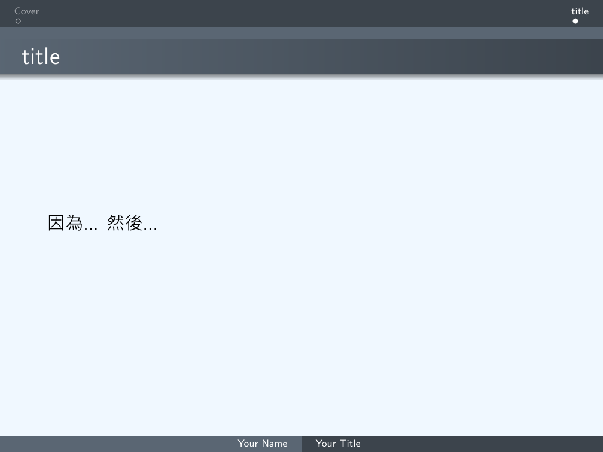
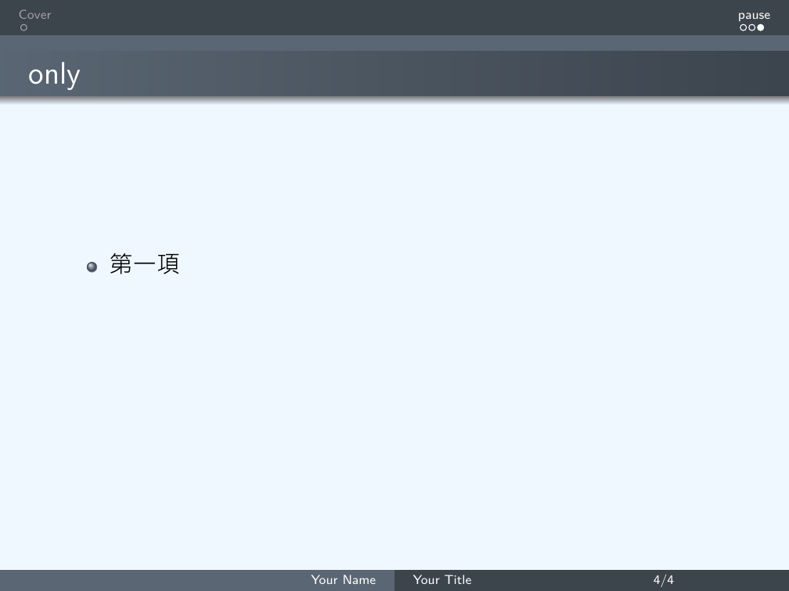
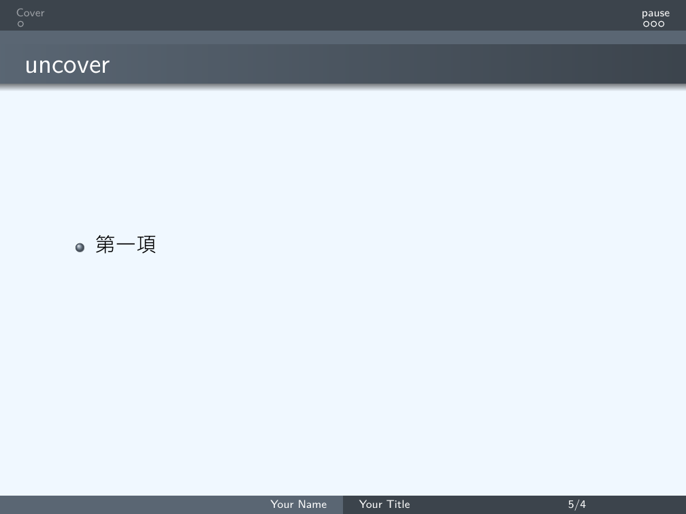
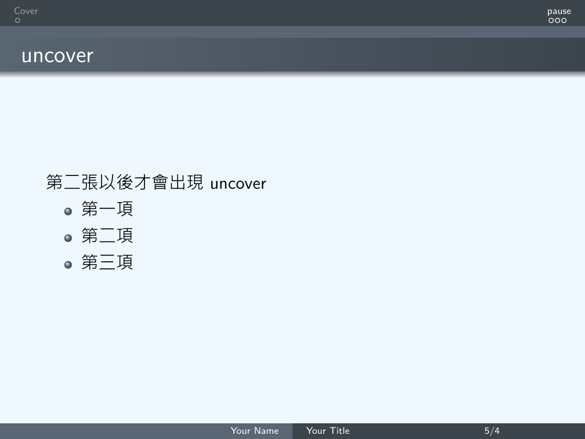

# 主題變換
```LaTeX
\usetheme{ThemeName}
```
## 內建主題  
|AnnArbor|Dresden |Marburg |
|:-:|:-:|:-:|
|Antibes |Frankfurt |Montpellier |
|Bergen |Goettingen |PaloAlto |
|Berkeley |Hannover |Pittsburgh |
|Berlin |Ilmenau |Rochester |
|Boadilla |JuanLesPins |Singapore |
|CambridgeUS |Luebeck |Szeged |

### 1. 顏色自定義
```LaTeX
\documentclass[xcolor=svgnames]{beamer}
\usecolortheme[named=LightSlateGrey]{structure}
\setbeamercolor{normal text}{fg=black,bg=AliceBlue}
\usetheme{Warsaw}
```
* 使用xcolor去改變顏色
    * dvipanames
    * svgnames
* Template:
    </br></br>
### 2. 樣式修改  
#### 內主題:
```LaTeX
\useinnertheme{circles}
```
* circles, inmargin, rectangles, rounded 
#### 外主題:
```LaTeX
\useoutertheme{miniframes}
```    
*  infolines, miniframes, shadow, sidebar, smoothbars, smoothtree, split, tree 
* Template:
    * 要加入section才會顯示出名稱
        ```LaTeX
        \section{SectionName}
        ```
    </br>
#### 標記:
```LaTeX
\setbeamertemplate{items}[rectangle]
```
|Name |Description |
|:-:|:-:|
|ball |3D 球形|
|circle |2D 圓形|
|rectangle |2D 方形|
|default |2D 三角|
## 內容控制
### 1.使用`\pause`來分段
```Latex
\section{內容控制}
\begin{frame}
\frametitle{title} %投影片標題
%%% content %%%
因為...
\pause
然後...
\pause
所以...
\end{frame}
```
* Template:
    </br></br>

### 2.條列式也可以用`\pause`暫停
```Latex
\begin{frame}
\frametitle{item+pause} %投影片標題
\begin{itemize}
\item 第一項
\pause
\item 第二項
\pause
\item 第三項
\end{itemize}
\end{frame}
```
* Template:
    </br></br>

### 3.更精確的控制- only vs uncover
#### \only<2->{第二張以後才會出現}
```Latex
\begin{frame}
\frametitle{uncover} %投影片標題
\uncover<2->{第二張以後才會出現uncover}
\begin{itemize}
\item<1-> 第一項
\item<2-> 第二項
\item<3-> 第三項
\end{itemize}
\end{frame}
```
* Template:
    </br></br>

#### \uncover<2->{第二張以後才會出現}
```Latex
\begin{frame}
\frametitle{uncover} %投影片標題
\uncover<2->{第二張以後才會出現uncover}
\begin{itemize}
\item<1-> 第一項
\item<2-> 第二項
\item<3-> 第三項
\end{itemize}
\end{frame}
```
* Template:
    </br></br>