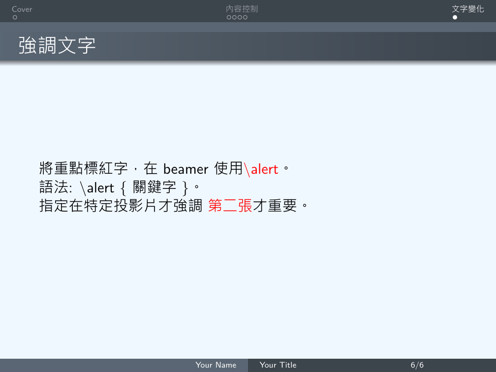
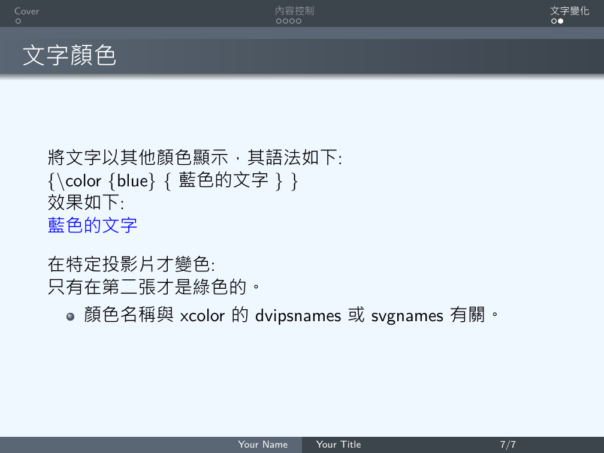
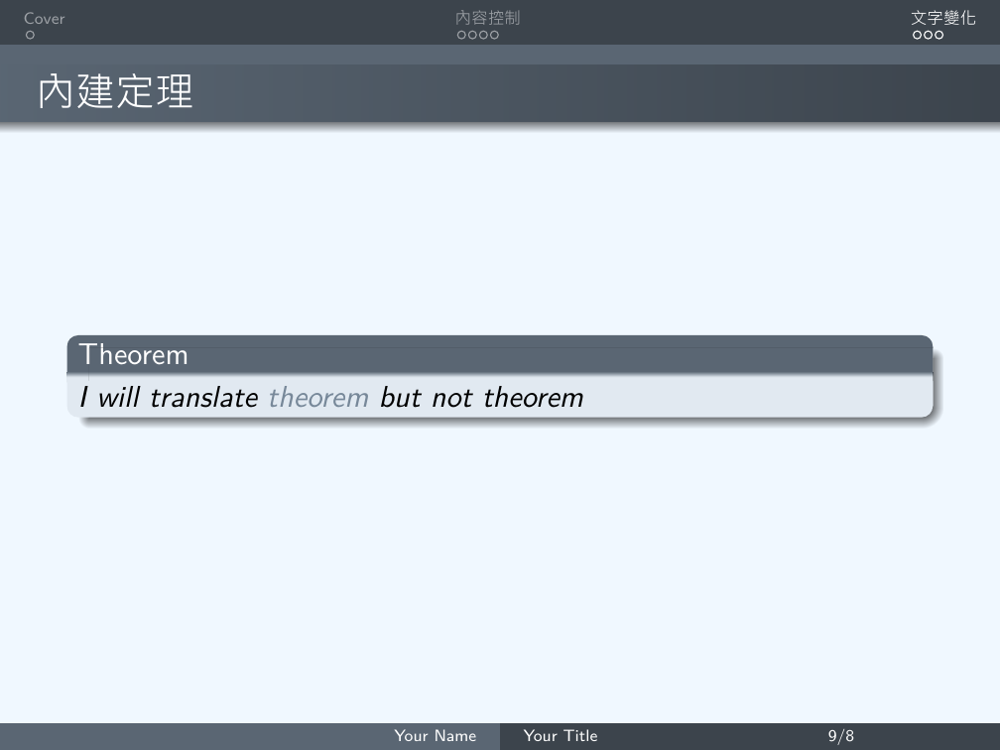

# 文字變化 --- [Back](https://github.com/Wilhelmine21/LaTeX-Beamer-PPT#how-to-create-a-ppt-using-latex)
### 1.標紅重點字
* 使用`\alert`來標紅
```Latex
\section{文字變化}
\begin{frame}
\frametitle{強調文字} %投影片標題
將重點標紅字，在beamer使用\alert{\textbackslash alert}。\\ 
語法:
\textbackslash alert $\lbrace$關鍵字$\rbrace$。\\ 
指定在特定投影片才強調  
\alert<2>{第二張}才重要。  
\end{frame}
```
* Template:
    </br></br>
### 2. 文字顏色
```Latex
\begin{frame}
\frametitle{文字顏色} %投影片標題
將文字以其他顏色顯示，其語法如下:\\
$\lbrace$\textbackslash color $\lbrace$blue$\rbrace$ $\lbrace$藍色的文字$\rbrace$ $\rbrace$\\
效果如下:\\
{\color{blue}{藍色的文字}}\\[10pt]
在特定投影片才變色:\\
只有在{\color<2>{green}{第二張}}才是綠色的。\\
\begin{itemize}
\item 顏色名稱與xcolor的dvipsnames 或svgnames有關。
\end{itemize}
\end{frame}
```
* Template:
    </br></br>
### 3. 文字框
```Latex
\begin{frame}
\frametitle{文字框} %投影片標題
\begin{block}{小重點}
小重點
\end{block}

\begin{alertblock}{大重點}
大重點
\end{alertblock}
\end{frame}
```
* Template:
    </br></br>

### 4. 內建定理
* definition, lemma, theorem, corollary, proof, example, examples
* 自定義: \newtheorem
```Latex
\begin{frame}
\frametitle{內建定理}
\begin{theorem}
I will translate \structure{\translate[to=spanish]{theorem}} but not theorem
\end{theorem}
\end{frame}
```
* Template:
    </br></br>